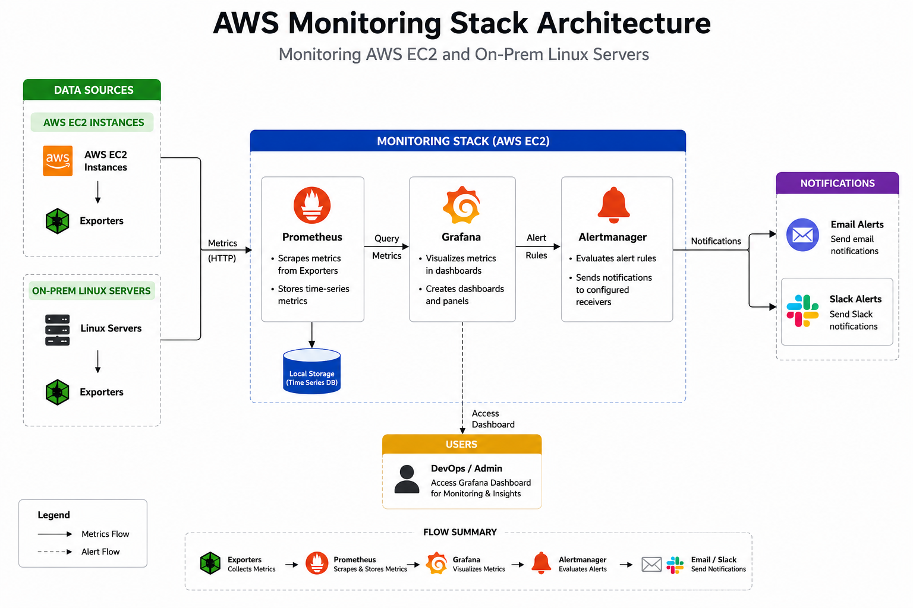

# 🚀 AWS Monitoring Stack

> A production-ready monitoring solution for **AWS EC2** and **On-Prem Linux Servers** using **Prometheus**, **Grafana**, **Alertmanager**, and **Node Exporter**.

---

# 📖 Overview

This project demonstrates a production-ready monitoring stack built to monitor AWS EC2 instances and On-Prem Linux servers.

The solution provides real-time infrastructure monitoring, centralized dashboards, and automated alerting to help identify and respond to system issues efficiently.

It represents a monitoring architecture commonly used in modern DevOps environments.

---

# 🏗️ Architecture



---

# ✨ Features

* ☁️ AWS EC2 Monitoring
* 🖥️ On-Prem Linux Server Monitoring
* 📊 Real-Time Infrastructure Monitoring
* ⚡ CPU Monitoring
* 🧠 Memory Monitoring
* 💽 Disk Usage Monitoring
* 🌐 Network Traffic Monitoring
* ⏱️ System Uptime Monitoring
* 📈 Grafana Dashboards
* 📡 Prometheus Metrics Collection
* 🚨 Alertmanager Integration
* 📧 Email Notifications
* 💬 Slack Notifications
* 📂 Production-Ready Folder Structure
* 🔄 Easily Scalable Architecture

---

# 🛠️ Tech Stack

| Category            | Technology    |
| ------------------- | ------------- |
| ☁️ Cloud            | AWS EC2       |
| 🐧 Operating System | Ubuntu Linux  |
| 📊 Monitoring       | Prometheus    |
| 📈 Visualization    | Grafana       |
| 🚨 Alerting         | Alertmanager  |
| 📡 Exporter         | Node Exporter |
| 📧 Notifications    | Email, Slack  |
| 🔧 Version Control  | Git, GitHub   |

---

# 📁 Project Structure

```text
monitoring-stack-aws-onprem/
│
├── README.md
├── architecture/
├── configs/
├── docs/
├── images/
└── scripts/
```

---

# 🔄 Monitoring Flow

```text
Linux Server (AWS / On-Prem)
        │
        ▼
  Node Exporter
        │
        ▼
    Prometheus
      │     │
      │     ▼
      │  Grafana
      │
      ▼
Alertmanager
   │      │
   ▼      ▼
Email   Slack
```

---

# 📸 Screenshots

## 🏗️ Architecture


---

## ☁️ AWS EC2 Instance


---

## 🎯 Prometheus Targets


---

## 📊 Grafana Dashboard


---

## 🚨 Alertmanager Dashboard


---

## 📧 Email Alert


---

## 💬 Slack Alert


---

## ⚡ CPU Monitoring


---

## 🧠 Memory Monitoring


---

## 💽 Disk Monitoring


---

## 🌐 Network Monitoring


---

# ⚙️ Configuration

This repository includes the configuration files used for the monitoring stack.

* 📄 Prometheus Configuration
* 📄 Alertmanager Configuration
* 📄 Grafana Dashboard
* 📄 Node Exporter Configuration

Configuration files are available inside the **`configs/`** directory.

---

# 🚀 Future Improvements

* ☸️ Kubernetes Monitoring
* 🌍 Multi-Server Monitoring
* 🔍 Blackbox Exporter Integration
* 📚 Loki Integration
* 📝 Promtail Integration
* 🔐 SSL/TLS Support
* ⚖️ High Availability (HA) Prometheus
* 🔑 OAuth / LDAP Authentication
* 🌱 Terraform Infrastructure
* 🤖 Automated Deployment using Ansible

---

# 📬 Contact

If you're looking for support with **AWS**, **Linux**, **Monitoring**, or **DevOps** projects, feel free to connect with me through GitHub.

⭐ **If you found this project useful, consider giving it a star!**
